Setup
-----

### Load packages

    setwd("D:/CourseraCourses/StatisticsWithR/Inference Statistics/Week5")
    library(ggplot2)
    library(dplyr)
    library(statsr)
    library(reshape2)

    ## Warning: package 'reshape2' was built under R version 4.0.2

### Load data

Make sure your data and R Markdown files are in the same directory. When
loaded your data file will be called `gss`. Delete this note when before
you submit your work.

    load("gss.Rdata")

------------------------------------------------------------------------

Part 1: Data
------------

Introduction
------------

This extract of the General Social Survey (GSS) Cumulative File
1972-2012 provides a sample of selected indicators in the GSS.

Since 1972, the General Social Survey (GSS) has been monitoring societal
change and studying the growing complexity of American society.

Based on Information about gss i’ve read , turns out this data is a
Sample from population.

    names(gss)

    ##   [1] "caseid"   "year"     "age"      "sex"      "race"     "hispanic"
    ##   [7] "uscitzn"  "educ"     "paeduc"   "maeduc"   "speduc"   "degree"  
    ##  [13] "vetyears" "sei"      "wrkstat"  "wrkslf"   "marital"  "spwrksta"
    ##  [19] "sibs"     "childs"   "agekdbrn" "incom16"  "born"     "parborn" 
    ##  [25] "granborn" "income06" "coninc"   "region"   "partyid"  "polviews"
    ##  [31] "relig"    "attend"   "natspac"  "natenvir" "natheal"  "natcity" 
    ##  [37] "natcrime" "natdrug"  "nateduc"  "natrace"  "natarms"  "nataid"  
    ##  [43] "natfare"  "natroad"  "natsoc"   "natmass"  "natpark"  "confinan"
    ##  [49] "conbus"   "conclerg" "coneduc"  "confed"   "conlabor" "conpress"
    ##  [55] "conmedic" "contv"    "conjudge" "consci"   "conlegis" "conarmy" 
    ##  [61] "joblose"  "jobfind"  "satjob"   "richwork" "jobinc"   "jobsec"  
    ##  [67] "jobhour"  "jobpromo" "jobmeans" "class"    "rank"     "satfin"  
    ##  [73] "finalter" "finrela"  "unemp"    "govaid"   "getaid"   "union"   
    ##  [79] "getahead" "parsol"   "kidssol"  "abdefect" "abnomore" "abhlth"  
    ##  [85] "abpoor"   "abrape"   "absingle" "abany"    "pillok"   "sexeduc" 
    ##  [91] "divlaw"   "premarsx" "teensex"  "xmarsex"  "homosex"  "suicide1"
    ##  [97] "suicide2" "suicide3" "suicide4" "fear"     "owngun"   "pistol"  
    ## [103] "shotgun"  "rifle"    "news"     "tvhours"  "racdif1"  "racdif2" 
    ## [109] "racdif3"  "racdif4"  "helppoor" "helpnot"  "helpsick" "helpblk"

------------------------------------------------------------------------

Part 2: Research question
-------------------------

1.  Are Race and religion of a Person tend to affecting his/her Suicide
    opinion ? .

Reason : Based On
<a href="https://www.macrotrends.net/countries/USA/united-states/suicide-rate" class="uri">https://www.macrotrends.net/countries/USA/united-states/suicide-rate</a>
US Suicide Case kept raising , so i think it’s a good idea to know
exactly what they thinking about “Ending” his/her own life from race and
religion perspective,in this scope. \* \* \*

Part 3: Exploratory data analysis
---------------------------------

NOTE: Insert code chunks as needed by clicking on the “Insert a new code
chunk” button (green button with orange arrow) above. Make sure that
your code is visible in the project you submit. Delete this note when
before you submit your work.

    #Take Our Variables of interest

    variables = c("race","relig","suicide1","suicide2","suicide3","suicide4")
    subsetgss <- gss[,variables]

    # Change the minor religions to Other
    subsetgss$relig <- dplyr::if_else(subsetgss$relig == "Inter-Nondenominational" | subsetgss$relig =="Other Eastern" |  
                                    subsetgss$relig == "Native American" , true = "Other" ,false = as.character(subsetgss$relig)) 

    ## Merge orthodox with Christian to one

    subsetgss$relig <- dplyr::if_else(subsetgss$relig == "Orthodox-Christian" ,"Christian" , as.character(subsetgss$relig))

    #Drop NA Values Since we want an answer for all .
    subsetgss <- subsetgss[! is.na(subsetgss$relig) & ! is.na(subsetgss$suicide1) &
                           ! is.na(subsetgss$suicide2) & !is.na(subsetgss$suicide3) & ! is.na(subsetgss$suicide4),]
    head(subsetgss)

    ##       race      relig suicide1 suicide2 suicide3 suicide4
    ## 7591 White   Catholic       No       No       No       No
    ## 7592 White   Catholic      Yes      Yes      Yes      Yes
    ## 7593 White   Catholic       No       No       No       No
    ## 7594 White       None      Yes       No       No       No
    ## 7595 White   Catholic      Yes       No       No       No
    ## 7596 White Protestant      Yes       No       No       No

    ## Turn Suicide Column into Var
    subsetgssMelt <- reshape2::melt(data = subsetgss , id.vars = c("race","relig") , variable.name = "Suicidetype")
    head(subsetgssMelt)

    ##    race      relig Suicidetype value
    ## 1 White   Catholic    suicide1    No
    ## 2 White   Catholic    suicide1   Yes
    ## 3 White   Catholic    suicide1    No
    ## 4 White       None    suicide1   Yes
    ## 5 White   Catholic    suicide1   Yes
    ## 6 White Protestant    suicide1   Yes

    ## Let's Check Race with 

    ggplot2::ggplot(data = subsetgssMelt , aes(x = race,fill = Suicidetype))+
            ggplot2::geom_bar(position = "dodge") + 
            ggplot2::facet_grid(. ~ relig) + 
            ggplot2::theme(axis.text.x = element_text(angle = 90))

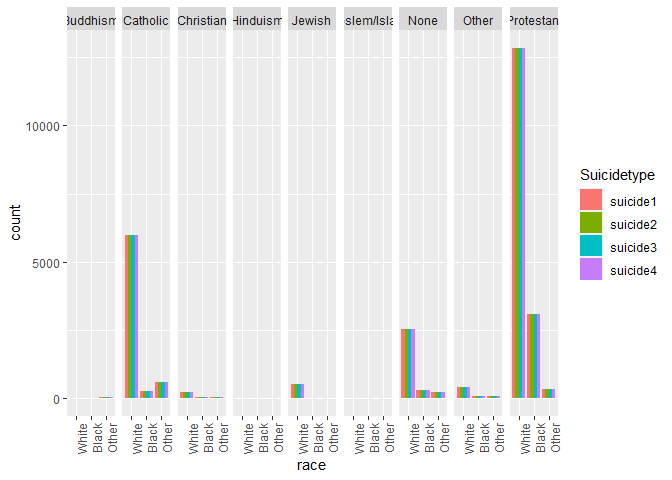

    # Looks like Protestant and catholic are the majority answering this question followed by the Atheist / None.

    # Now Let's Focus On Protestant , catholic , None ,jewish and Other .

    # we're going to drop Moslem , Buddhism , Hinduism , and Christian .

    # Do you think a person has the right to end his or her own life if this person: a. Has an incurable disease?

    Majority <- subset(subsetgss , relig == "Catholic" | relig == "Protestant" |
                               relig == "None" | relig == "Other" )
    ## Plot The suicide 1 Overall result

    ggplot2::ggplot(data = Majority , aes(x = race , fill = suicide1)) + 
            ggplot2::geom_bar(position = "dodge") +
            ggplot2::facet_grid(. ~ c(relig)) +
            ggplot2::theme(axis.text.x = element_text(angle = 90)) 

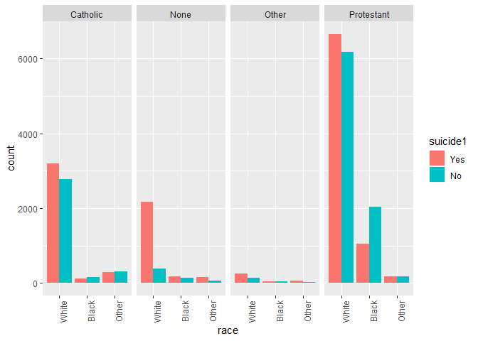

    ## We can see Here , 3 out of 4 Religions are more likely to aggree with Questionare number 1

    ## Let's See About second question 

    # Do you think a person has the right to end his or her own life if this person: b. Has gone bankrupt?

    ggplot2::ggplot(data = Majority , aes(x = race , fill = suicide2)) + 
            ggplot2::geom_bar(position = "dodge") +
            ggplot2::facet_grid(. ~ c(relig)) +
            ggplot2::theme(axis.text.x = element_text(angle = 90)) 

    ## Ah new intresting Cases : 

    # We can see Here , 4 out of 4 Religions are more likely not to aggree with Question number 2

    # Let's See The Suicide 3  now

    #Do you think a person has the right to end his or her own life if this person: c. Has dishonored his or her family?

    ggplot2::ggplot(data = Majority , aes(x = race , fill = suicide3)) + 
            ggplot2::geom_bar(position = "dodge") +
            ggplot2::facet_grid(. ~ c(relig)) +
            ggplot2::theme(axis.text.x = element_text(angle = 90)) 

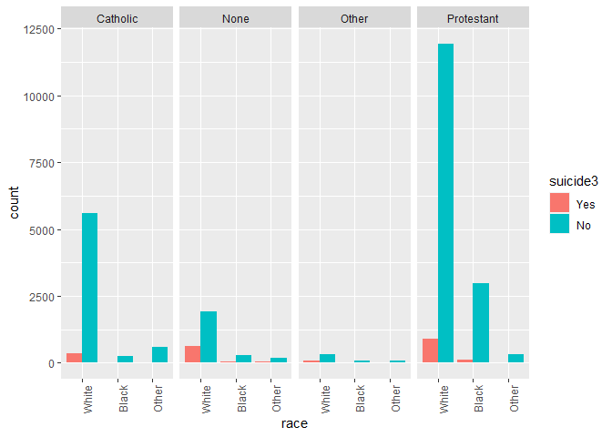

    # Ah new intresting Cases : 

    # We can see Here , 4 out of 4 Religions are more likely not to aggree with Question number 3

    # Letsee Last Question 

    # Do you think a person has the right to end his or her own life if this person: d. Is tired of living and ready to die?

    ggplot2::ggplot(data = Majority , aes(x = race , fill = suicide4)) + 
            ggplot2::geom_bar(position = "dodge") +
            ggplot2::facet_grid(. ~ c(relig)) +
            ggplot2::theme(axis.text.x = element_text(angle = 90)) 

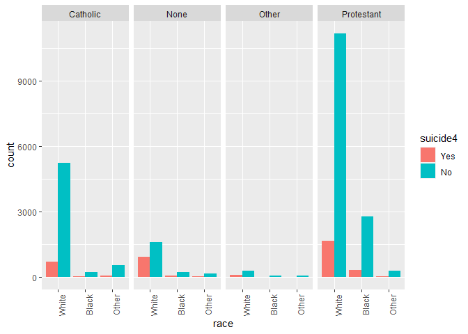

    # Ah new intresting Cases : 

    # We can see Here , 4 out of 4 Religions are more likely not to aggree with Question number 3

------------------------------------------------------------------------

Part 4: Inference
-----------------

### First Inference :

    paste("We're going to inference the diffrent between the race and religion")

    ## [1] "We're going to inference the diffrent between the race and religion"

    paste("H0 : There's no difference between race and religion")

    ## [1] "H0 : There's no difference between race and religion"

    paste("HA : There's a difference between race and religion")

    ## [1] "HA : There's a difference between race and religion"

    paste("Checking Condition : ")

    ## [1] "Checking Condition : "

    paste("Random Sampled , is achieved")

    ## [1] "Random Sampled , is achieved"

    paste("Each case only contribute to one cell ,Achieved")

    ## [1] "Each case only contribute to one cell ,Achieved"

    paste("Sample Size at least 5 cell achieved ")

    ## [1] "Sample Size at least 5 cell achieved "

    paste("We're going to use Chi square test of difference")

    ## [1] "We're going to use Chi square test of difference"

    paste("Using theoretical because our sample achived all assumptions")

    ## [1] "Using theoretical because our sample achived all assumptions"

    paste("Using proportion ,because both is categorical variables")

    ## [1] "Using proportion ,because both is categorical variables"

    statsr::inference(data = Majority ,y = race , x = relig ,method = "theoretical",
                      statistic = "proportion",type = "ht" ,null = 0 , alternative = "greater")

    ## Warning: Ignoring null value since it's undefined for chi-square test of
    ## independence

    ## Response variable: categorical (3 levels) 
    ## Explanatory variable: categorical (4 levels) 
    ## Observed:
    ##             y
    ## x            White Black Other
    ##   Catholic    5973   275   616
    ##   None        2558   326   221
    ##   Other        404    84    88
    ##   Protestant 12833  3103   354
    ## 
    ## Expected:
    ##             y
    ## x                 White      Black    Other
    ##   Catholic    5567.9356  968.91492 327.1495
    ##   None        2518.7121  438.29849 147.9894
    ##   Other        467.2394   81.30755  27.4531
    ##   Protestant 13214.1129 2299.47904 776.4080
    ## 
    ## H0: relig and race are independent
    ## HA: relig and race are dependent
    ## chi_sq = 1510.6412, df = 6, p_value = 0

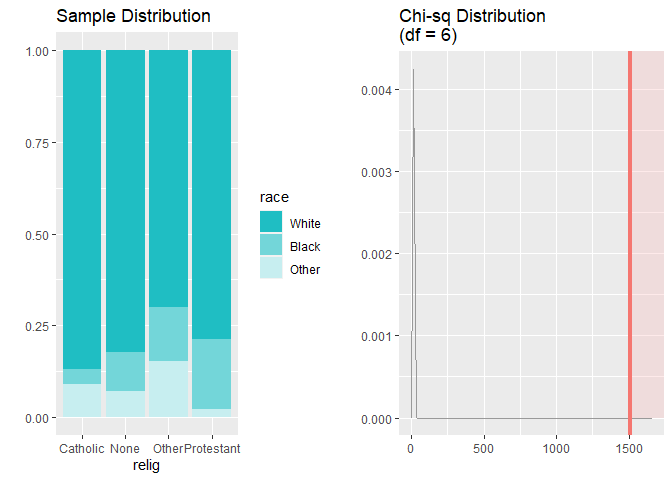

    ?inference

    ## starting httpd help server ... done

    # From The output we know that we should Reject H0 , then our conclusion :
    # There's a significance evidence that race and religion is difference  ie Dependent . 

    # Now lets see if yeses answers is dependent to religion and race . we'll take a look with religion first

    paste("We're going to inference the diffrent between the race and religion")

    ## [1] "We're going to inference the diffrent between the race and religion"

    paste("H0 : There's no difference between Suicide1 and religion")

    ## [1] "H0 : There's no difference between Suicide1 and religion"

    paste("HA : There's a difference between Suicide1 and religion")

    ## [1] "HA : There's a difference between Suicide1 and religion"

    paste("Checking Condition : ")

    ## [1] "Checking Condition : "

    paste("Random Sampled , is achieved")

    ## [1] "Random Sampled , is achieved"

    paste("Each case only contribute to one cell ,Achieved")

    ## [1] "Each case only contribute to one cell ,Achieved"

    paste("Sample Size at least 5 cell achieved ")

    ## [1] "Sample Size at least 5 cell achieved "

    paste("We're going to use Chi square test of difference")

    ## [1] "We're going to use Chi square test of difference"

    paste("Using theoretical because our sample achived all assumptions")

    ## [1] "Using theoretical because our sample achived all assumptions"

    paste("Using proportion ,because both is categorical variables")

    ## [1] "Using proportion ,because both is categorical variables"

    statsr::inference(data = Majority ,y = suicide1 , x = relig ,method = "theoretical",
                      statistic = "proportion",type = "ht" ,null = 0 ,
                      alternative = "greater",success = "yes")

    ## Warning: Ignoring null value since it's undefined for chi-square test of
    ## independence

    ## Response variable: categorical (2 levels) 
    ## Explanatory variable: categorical (4 levels) 
    ## Observed:
    ##             y
    ## x             Yes   No
    ##   Catholic   3625 3239
    ##   None       2517  588
    ##   Other       359  217
    ##   Protestant 7877 8413
    ## 
    ## Expected:
    ##             y
    ## x                  Yes        No
    ##   Catholic   3677.6818 3186.3182
    ##   None       1663.6367 1441.3633
    ##   Other       308.6167  267.3833
    ##   Protestant 8728.0648 7561.9352
    ## 
    ## H0: relig and suicide1 are independent
    ## HA: relig and suicide1 are dependent
    ## chi_sq = 1141.0846, df = 3, p_value = 0

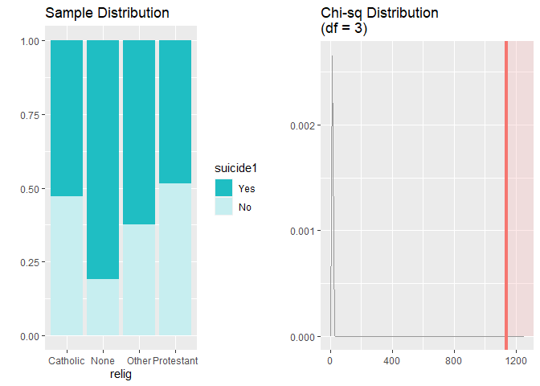

    ## We Can See At our output , "yes" Answer in question 1 is Dependent with religion

    paste("We're going to inference the diffrent between the Suicide2 and religion")

    ## [1] "We're going to inference the diffrent between the Suicide2 and religion"

    paste("H0 : There's no difference between Suicide2 and religion")

    ## [1] "H0 : There's no difference between Suicide2 and religion"

    paste("HA : There's a difference between Suicide2 and religion")

    ## [1] "HA : There's a difference between Suicide2 and religion"

    paste("Checking Condition : ")

    ## [1] "Checking Condition : "

    paste("Random Sampled , is achieved")

    ## [1] "Random Sampled , is achieved"

    paste("Each case only contribute to one cell ,Achieved")

    ## [1] "Each case only contribute to one cell ,Achieved"

    paste("Sample Size at least 5 cell achieved ")

    ## [1] "Sample Size at least 5 cell achieved "

    paste("We're going to use Chi square test of difference")

    ## [1] "We're going to use Chi square test of difference"

    paste("Using theoretical because our sample achived all assumptions")

    ## [1] "Using theoretical because our sample achived all assumptions"

    paste("Using proportion ,because both is categorical variables")

    ## [1] "Using proportion ,because both is categorical variables"

    statsr::inference(data = Majority ,y = suicide2 , x = relig ,method = "theoretical",
                      statistic = "proportion",type = "ht" ,null = 0 ,
                      alternative = "greater",success = "no")

    ## Warning: Ignoring null value since it's undefined for chi-square test of
    ## independence

    ## Response variable: categorical (2 levels) 
    ## Explanatory variable: categorical (4 levels) 
    ## Observed:
    ##             y
    ## x              Yes    No
    ##   Catholic     412  6452
    ##   None         696  2409
    ##   Other         86   490
    ##   Protestant  1043 15247
    ## 
    ## Expected:
    ##             y
    ## x                  Yes         No
    ##   Catholic    572.1918  6291.8082
    ##   None        258.8368  2846.1632
    ##   Other        48.0161   527.9839
    ##   Protestant 1357.9553 14932.0447
    ## 
    ## H0: relig and suicide2 are independent
    ## HA: relig and suicide2 are dependent
    ## chi_sq = 966.8938, df = 3, p_value = 0

    ## We Can See At our output , "No" Answer in question 2 is Dependent with religion

    paste("We're going to inference the diffrent between the Suicide2 and religion")

    ## [1] "We're going to inference the diffrent between the Suicide2 and religion"

    paste("H0 : There's no difference between Suicide3 and religion")

    ## [1] "H0 : There's no difference between Suicide3 and religion"

    paste("HA : There's a difference between Suicide3 and religion")

    ## [1] "HA : There's a difference between Suicide3 and religion"

    paste("Checking Condition : ")

    ## [1] "Checking Condition : "

    paste("Random Sampled , is achieved")

    ## [1] "Random Sampled , is achieved"

    paste("Each case only contribute to one cell ,Achieved")

    ## [1] "Each case only contribute to one cell ,Achieved"

    paste("Sample Size at least 5 cell achieved ")

    ## [1] "Sample Size at least 5 cell achieved "

    paste("We're going to use Chi square test of difference")

    ## [1] "We're going to use Chi square test of difference"

    paste("Using theoretical because our sample achived all assumptions")

    ## [1] "Using theoretical because our sample achived all assumptions"

    paste("Using proportion ,because both is categorical variables")

    ## [1] "Using proportion ,because both is categorical variables"

    statsr::inference(data = Majority ,y = suicide3 , x = relig ,method = "theoretical",
                      statistic = "proportion",type = "ht" ,null = 0 ,
                      alternative = "greater",success = "no")

    ## Warning: Ignoring null value since it's undefined for chi-square test of
    ## independence

    ## Response variable: categorical (2 levels) 
    ## Explanatory variable: categorical (4 levels) 
    ## Observed:
    ##             y
    ## x              Yes    No
    ##   Catholic     403  6461
    ##   None         701  2404
    ##   Other         96   480
    ##   Protestant  1071 15219
    ## 
    ## Expected:
    ##             y
    ## x                   Yes         No
    ##   Catholic    580.88854  6283.1115
    ##   None        262.77082  2842.2292
    ##   Other        48.74589   527.2541
    ##   Protestant 1378.59475 14911.4053
    ## 
    ## H0: relig and suicide3 are independent
    ## HA: relig and suicide3 are dependent
    ## chi_sq = 982.9451, df = 3, p_value = 0

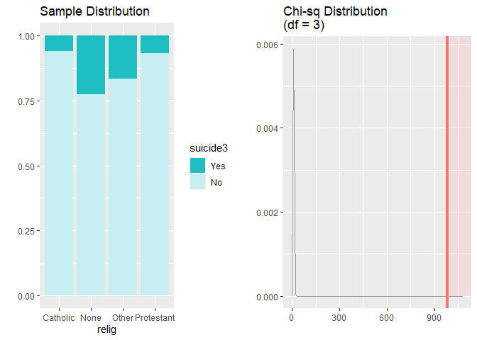

    ## We Can See At our output , "no" Answer in question 3 is also Dependent with religion

    paste("We're going to inference the diffrent between the Suicide4 and religion")

    ## [1] "We're going to inference the diffrent between the Suicide4 and religion"

    paste("H0 : There's no difference between Suicide4 and religion")

    ## [1] "H0 : There's no difference between Suicide4 and religion"

    paste("HA : There's a difference between Suicide4 and religion")

    ## [1] "HA : There's a difference between Suicide4 and religion"

    paste("Checking Condition : ")

    ## [1] "Checking Condition : "

    paste("Random Sampled , is achieved")

    ## [1] "Random Sampled , is achieved"

    paste("Each case only contribute to one cell ,Achieved")

    ## [1] "Each case only contribute to one cell ,Achieved"

    paste("Sample Size at least 5 cell achieved ")

    ## [1] "Sample Size at least 5 cell achieved "

    paste("We're going to use Chi square test of difference")

    ## [1] "We're going to use Chi square test of difference"

    paste("Using theoretical because our sample achived all assumptions")

    ## [1] "Using theoretical because our sample achived all assumptions"

    paste("Using proportion ,because both is categorical variables")

    ## [1] "Using proportion ,because both is categorical variables"

    statsr::inference(data = Majority ,y = suicide4 , x = relig ,method = "theoretical",
                      statistic = "proportion",type = "ht" ,null = 0 ,
                      alternative = "greater",success = "no")

    ## Warning: Ignoring null value since it's undefined for chi-square test of
    ## independence

    ## Response variable: categorical (2 levels) 
    ## Explanatory variable: categorical (4 levels) 
    ## Observed:
    ##             y
    ## x              Yes    No
    ##   Catholic     822  6042
    ##   None        1086  2019
    ##   Other        146   430
    ##   Protestant  2058 14232
    ## 
    ## Expected:
    ##             y
    ## x                   Yes        No
    ##   Catholic   1051.78938  5812.211
    ##   None        475.78759  2629.212
    ##   Other        88.26205   487.738
    ##   Protestant 2496.16098 13793.839
    ## 
    ## H0: relig and suicide4 are independent
    ## HA: relig and suicide4 are dependent
    ## chi_sq = 1118.9637, df = 3, p_value = 0

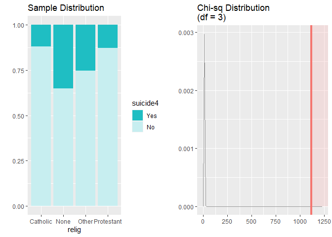

    ## We Can See At our output , "no" Answer in question 4 is also Dependent with religion

    # Let's Check the Race now

    paste("H0 : There's no difference between race and suicide1")

    ## [1] "H0 : There's no difference between race and suicide1"

    paste("HA : There's a difference between race and Suicide1")

    ## [1] "HA : There's a difference between race and Suicide1"

    paste("Checking Condition : ")

    ## [1] "Checking Condition : "

    paste("Random Sampled , is achieved")

    ## [1] "Random Sampled , is achieved"

    paste("Each case only contribute to one cell ,Achieved")

    ## [1] "Each case only contribute to one cell ,Achieved"

    paste("Sample Size at least 5 cell achieved ")

    ## [1] "Sample Size at least 5 cell achieved "

    paste("We're going to use Chi square test of difference")

    ## [1] "We're going to use Chi square test of difference"

    paste("Using theoretical because our sample achived all assumptions")

    ## [1] "Using theoretical because our sample achived all assumptions"

    paste("Using proportion ,because both is categorical variables")

    ## [1] "Using proportion ,because both is categorical variables"

    statsr::inference(data = Majority ,y = suicide1 , x = race ,method = "theoretical",
                      statistic = "proportion",type = "ht" ,null = 0 ,
                      alternative = "greater",success = "yes")

    ## Warning: Ignoring null value since it's undefined for chi-square test of
    ## independence

    ## Response variable: categorical (2 levels) 
    ## Explanatory variable: categorical (3 levels) 
    ## Observed:
    ##        y
    ## x         Yes    No
    ##   White 12288  9480
    ##   Black  1401  2387
    ##   Other   689   590
    ## 
    ## Expected:
    ##        y
    ## x             Yes        No
    ##   White 11663.138 10104.862
    ##   Black  2029.583  1758.417
    ##   Other   685.279   593.721
    ## 
    ## H0: race and suicide1 are independent
    ## HA: race and suicide1 are dependent
    ## chi_sq = 491.5402, df = 2, p_value = 0

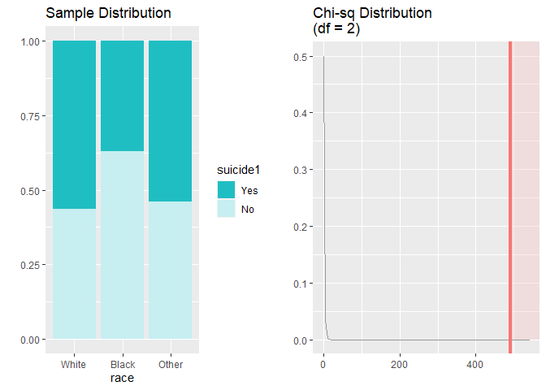

    ## We Can See At our output , "yes" Answer in question 1 is also Dependent with race

    paste("H0 : There's no difference between race and suicide2")

    ## [1] "H0 : There's no difference between race and suicide2"

    paste("HA : There's a difference between race and Suicide2")

    ## [1] "HA : There's a difference between race and Suicide2"

    paste("Checking Condition : ")

    ## [1] "Checking Condition : "

    paste("Random Sampled , is achieved")

    ## [1] "Random Sampled , is achieved"

    paste("Each case only contribute to one cell ,Achieved")

    ## [1] "Each case only contribute to one cell ,Achieved"

    paste("Sample Size at least 5 cell achieved ")

    ## [1] "Sample Size at least 5 cell achieved "

    paste("We're going to use Chi square test of difference")

    ## [1] "We're going to use Chi square test of difference"

    paste("Using theoretical because our sample achived all assumptions")

    ## [1] "Using theoretical because our sample achived all assumptions"

    paste("Using proportion ,because both is categorical variables")

    ## [1] "Using proportion ,because both is categorical variables"

    statsr::inference(data = Majority ,y = suicide2 , x = race ,method = "theoretical",
                      statistic = "proportion",type = "ht" ,null = 0 ,
                      alternative = "greater",success = "no")

    ## Warning: Ignoring null value since it's undefined for chi-square test of
    ## independence

    ## Response variable: categorical (2 levels) 
    ## Explanatory variable: categorical (3 levels) 
    ## Observed:
    ##        y
    ## x         Yes    No
    ##   White  1925 19843
    ##   Black   207  3581
    ##   Other   105  1174
    ## 
    ## Expected:
    ##        y
    ## x             Yes        No
    ##   White 1814.6084 19953.392
    ##   Black  315.7725  3472.227
    ##   Other  106.6191  1172.381
    ## 
    ## H0: race and suicide2 are independent
    ## HA: race and suicide2 are dependent
    ## chi_sq = 48.229, df = 2, p_value = 0

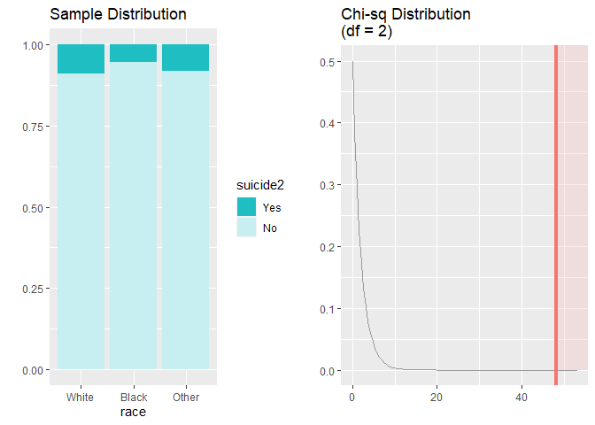

    ## We Can See At our output , "no" Answer in question 2 is also Dependent with race

    paste("H0 : There's no difference between race and suicide3")

    ## [1] "H0 : There's no difference between race and suicide3"

    paste("HA : There's a difference between race and Suicide3")

    ## [1] "HA : There's a difference between race and Suicide3"

    paste("Checking Condition : ")

    ## [1] "Checking Condition : "

    paste("Random Sampled , is achieved")

    ## [1] "Random Sampled , is achieved"

    paste("Each case only contribute to one cell ,Achieved")

    ## [1] "Each case only contribute to one cell ,Achieved"

    paste("Sample Size at least 5 cell achieved ")

    ## [1] "Sample Size at least 5 cell achieved "

    paste("We're going to use Chi square test of difference")

    ## [1] "We're going to use Chi square test of difference"

    paste("Using theoretical because our sample achived all assumptions")

    ## [1] "Using theoretical because our sample achived all assumptions"

    paste("Using proportion ,because both is categorical variables")

    ## [1] "Using proportion ,because both is categorical variables"

    statsr::inference(data = Majority ,y = suicide3 , x = race ,method = "theoretical",
                      statistic = "proportion",type = "ht" ,null = 0 ,
                      alternative = "greater",success = "no")

    ## Warning: Ignoring null value since it's undefined for chi-square test of
    ## independence

    ## Response variable: categorical (2 levels) 
    ## Explanatory variable: categorical (3 levels) 
    ## Observed:
    ##        y
    ## x         Yes    No
    ##   White  1961 19807
    ##   Black   200  3588
    ##   Other   110  1169
    ## 
    ## Expected:
    ##        y
    ## x             Yes        No
    ##   White 1842.1885 19925.812
    ##   Black  320.5719  3467.428
    ##   Other  108.2396  1170.760
    ## 
    ## H0: race and suicide3 are independent
    ## HA: race and suicide3 are dependent
    ## chi_sq = 57.944, df = 2, p_value = 0

    ## We Can See At our output , "no" Answer in question 3 is also Dependent with race

    paste("H0 : There's no difference between race and suicide3")

    ## [1] "H0 : There's no difference between race and suicide3"

    paste("HA : There's a difference between race and Suicide3")

    ## [1] "HA : There's a difference between race and Suicide3"

    paste("Checking Condition : ")

    ## [1] "Checking Condition : "

    paste("Random Sampled , is achieved")

    ## [1] "Random Sampled , is achieved"

    paste("Each case only contribute to one cell ,Achieved")

    ## [1] "Each case only contribute to one cell ,Achieved"

    paste("Sample Size at least 5 cell achieved ")

    ## [1] "Sample Size at least 5 cell achieved "

    paste("We're going to use Chi square test of difference")

    ## [1] "We're going to use Chi square test of difference"

    paste("Using theoretical because our sample achived all assumptions")

    ## [1] "Using theoretical because our sample achived all assumptions"

    paste("Using proportion ,because both is categorical variables")

    ## [1] "Using proportion ,because both is categorical variables"

    statsr::inference(data = Majority ,y = suicide4 , x = race ,method = "theoretical",
                      statistic = "proportion",type = "ht" ,null = 0 ,
                      alternative = "greater",success = "no")

    ## Warning: Ignoring null value since it's undefined for chi-square test of
    ## independence

    ## Response variable: categorical (2 levels) 
    ## Explanatory variable: categorical (3 levels) 
    ## Observed:
    ##        y
    ## x         Yes    No
    ##   White  3463 18305
    ##   Black   466  3322
    ##   Other   183  1096
    ## 
    ## Expected:
    ##        y
    ## x             Yes        No
    ##   White 3335.5698 18432.430
    ##   Black  580.4455  3207.554
    ##   Other  195.9846  1083.015
    ## 
    ## H0: race and suicide4 are independent
    ## HA: race and suicide4 are dependent
    ## chi_sq = 33.4137, df = 2, p_value = 0

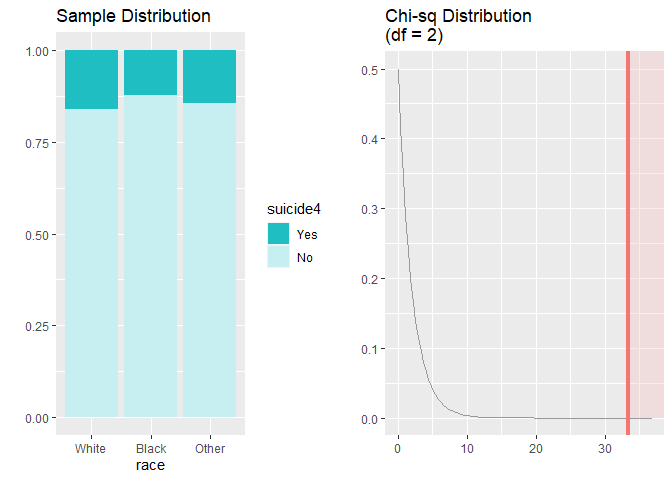

    ## We Can See At our output , "no" Answer in question 3 is also Dependent with race

    # Interpretation :

    paste("Now We Can Make an conclusion : people /opinion related to died ,more likely to say no and yes religion and race affected their answer, because we know that our life is simply once > whatever your struggle is kept fight it. Don't let your life go easily.But because we only used race and religion , there's might be another factor to affect someone suicide. ")

    ## [1] "Now We Can Make an conclusion : people /opinion related to died ,more likely to say no and yes religion and race affected their answer, because we know that our life is simply once > whatever your struggle is kept fight it. Don't let your life go easily.But because we only used race and religion , there's might be another factor to affect someone suicide. "

NOTE: Insert code chunks as needed by clicking on the “Insert a new code
chunk” button (green button with orange arrow) above. Make sure that
your code is visible in the project you submit. Delete this note when
before you submit your work.
