Setup
-----

### Load packages

    library(ggplot2)
    library(dplyr)
    library(statsr)
    library(GGally)

    ## Warning: package 'GGally' was built under R version 4.0.2

    library(gridExtra)

### Load data

Make sure your data and R Markdown files are in the same directory. When
loaded your data file will be called `movies`. Delete this note when
before you submit your work.

    setwd("D:\\CourseraCourses\\StatisticsWithR\\Regression models\\Week4")
    load("movies.Rdata")
    head(movies)

    ## # A tibble: 6 x 32
    ##   title title_type genre runtime mpaa_rating studio thtr_rel_year thtr_rel_month
    ##   <chr> <fct>      <fct>   <dbl> <fct>       <fct>          <dbl>          <dbl>
    ## 1 Fill~ Feature F~ Drama      80 R           Indom~          2013              4
    ## 2 The ~ Feature F~ Drama     101 PG-13       Warne~          2001              3
    ## 3 Wait~ Feature F~ Come~      84 R           Sony ~          1996              8
    ## 4 The ~ Feature F~ Drama     139 PG          Colum~          1993             10
    ## 5 Male~ Feature F~ Horr~      90 R           Ancho~          2004              9
    ## 6 Old ~ Documenta~ Docu~      78 Unrated     Shcal~          2009              1
    ## # ... with 24 more variables: thtr_rel_day <dbl>, dvd_rel_year <dbl>,
    ## #   dvd_rel_month <dbl>, dvd_rel_day <dbl>, imdb_rating <dbl>,
    ## #   imdb_num_votes <int>, critics_rating <fct>, critics_score <dbl>,
    ## #   audience_rating <fct>, audience_score <dbl>, best_pic_nom <fct>,
    ## #   best_pic_win <fct>, best_actor_win <fct>, best_actress_win <fct>,
    ## #   best_dir_win <fct>, top200_box <fct>, director <chr>, actor1 <chr>,
    ## #   actor2 <chr>, actor3 <chr>, actor4 <chr>, actor5 <chr>, imdb_url <chr>,
    ## #   rt_url <chr>

------------------------------------------------------------------------

Part 1: Data
------------

Introduction : About data
-------------------------

Taken From IMBD, the data set is comprised of 651 randomly sampled
movies produced and released before 2016.

------------------------------------------------------------------------

Part 2: Research question
-------------------------

1.  What’s the best for predicting IMDB Rating ?

------------------------------------------------------------------------

Part 3: Exploratory data analysis
---------------------------------

    ## Subset The Movies 
    names(movies)

    ##  [1] "title"            "title_type"       "genre"            "runtime"         
    ##  [5] "mpaa_rating"      "studio"           "thtr_rel_year"    "thtr_rel_month"  
    ##  [9] "thtr_rel_day"     "dvd_rel_year"     "dvd_rel_month"    "dvd_rel_day"     
    ## [13] "imdb_rating"      "imdb_num_votes"   "critics_rating"   "critics_score"   
    ## [17] "audience_rating"  "audience_score"   "best_pic_nom"     "best_pic_win"    
    ## [21] "best_actor_win"   "best_actress_win" "best_dir_win"     "top200_box"      
    ## [25] "director"         "actor1"           "actor2"           "actor3"          
    ## [29] "actor4"           "actor5"           "imdb_url"         "rt_url"

    desiredPredictors <- c("title_type","runtime","mpaa_rating","imdb_num_votes","critics_score","audience_score","genre","imdb_rating")

    subsetMovies <-as.data.frame( movies[, desiredPredictors])
    subsetMovies <- na.omit(subsetMovies)

    head(subsetMovies)

    ##     title_type runtime mpaa_rating imdb_num_votes critics_score audience_score
    ## 1 Feature Film      80           R            899            45             73
    ## 2 Feature Film     101       PG-13          12285            96             81
    ## 3 Feature Film      84           R          22381            91             91
    ## 4 Feature Film     139          PG          35096            80             76
    ## 5 Feature Film      90           R           2386            33             27
    ## 6  Documentary      78     Unrated            333            91             86
    ##         genre imdb_rating
    ## 1       Drama         5.5
    ## 2       Drama         7.3
    ## 3      Comedy         7.6
    ## 4       Drama         7.2
    ## 5      Horror         5.1
    ## 6 Documentary         7.8

    # let's See Their Correlation for each numerical predictors
    numericPredictors <- c("imdb_rating","runtime", "imdb_num_votes", "critics_score", "audience_score")

    GGally::ggpairs(data = subsetMovies,columns = numericPredictors )

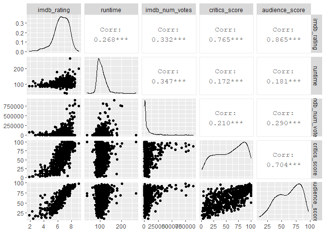

Seems Like Audience Score and Critics Score are highly correlated , m
going to drop critics score since audience\_Score is highly correlated
with imdb\_rating.

    # lets see the categorical variable then

    str(subsetMovies) # We will fit it with all numerical data 

    ## 'data.frame':    650 obs. of  8 variables:
    ##  $ title_type    : Factor w/ 3 levels "Documentary",..: 2 2 2 2 2 1 2 2 1 2 ...
    ##  $ runtime       : num  80 101 84 139 90 78 142 93 88 119 ...
    ##  $ mpaa_rating   : Factor w/ 6 levels "G","NC-17","PG",..: 5 4 5 3 5 6 4 5 6 6 ...
    ##  $ imdb_num_votes: int  899 12285 22381 35096 2386 333 5016 2272 880 12496 ...
    ##  $ critics_score : num  45 96 91 80 33 91 57 17 90 83 ...
    ##  $ audience_score: num  73 81 91 76 27 86 76 47 89 66 ...
    ##  $ genre         : Factor w/ 11 levels "Action & Adventure",..: 6 6 4 6 7 5 6 6 5 6 ...
    ##  $ imdb_rating   : num  5.5 7.3 7.6 7.2 5.1 7.8 7.2 5.5 7.5 6.6 ...
    ##  - attr(*, "na.action")= 'omit' Named int 334
    ##   ..- attr(*, "names")= chr "334"

    numericPredictors <- c("runtime", "imdb_num_votes", "critics_score", "audience_score")
    categoricalPredictor <- c("title_type", "mpaa_rating", "genre")

    index <- 1
    ggplot_list <- list() # Creating Vector for keeping the plotted Objs
    for (categoricalvarX in categoricalPredictor){
       if(categoricalvarX == "title_type"){
            print(categoricalvarX)
            FirstPlot <-   ggplot(data = subsetMovies,aes(y = imdb_rating,
                                                    x = subsetMovies[, categoricalPredictor[1]]))+
                          ggplot2::geom_boxplot(aes(fill = subsetMovies[, categoricalPredictor[2]] ))+
                          ggplot2::labs(x = categoricalvarX )+
                          ggplot2::theme(axis.text.x = element_text(angle = 90)) + 
                          ggplot2::guides(fill = guide_legend(title = toupper(categoricalPredictor[2])))+
                          ggplot2::theme(legend.key.size = unit(0.5, "cm")) +
                          ggplot2::scale_y_continuous(limits = c(1, 10))
            
            SecondPlot <- ggplot(data = subsetMovies , aes(y = imdb_rating,
                                                           x = subsetMovies[, categoricalPredictor[1]]))+
                          ggplot2::geom_boxplot(aes(fill = subsetMovies[, categoricalPredictor[3]] ))+
                          ggplot2::labs(x = categoricalvarX) + 
                          ggplot2::theme(axis.text.x = element_text(angle = 90)) + 
                          ggplot2::guides(fill = guide_legend(title = toupper(categoricalPredictor[3])))+
                          ggplot2::theme(legend.key.size = unit(0.5, "cm"))+
                          ggplot2::scale_y_continuous(limits = c(1, 10))
                                     
            ggplot_list[[index]] <- FirstPlot
            ggplot_list[[index + 1]] <- SecondPlot
            print(index)
            index = index + 2
       }else if(categoricalvarX == "mpaa_rating"){
            print(categoricalvarX)   
            FirstPlot <-  ggplot(data = subsetMovies,aes(y = imdb_rating,
                                                    x = subsetMovies[, categoricalPredictor[2]]))+
                          ggplot2::geom_boxplot(aes(fill = subsetMovies[, categoricalPredictor[1]] ))+
                          ggplot2::labs(x = categoricalvarX ) + 
                          ggplot2::theme(axis.text.x = element_text(angle = 90)) + 
                          ggplot2::guides(fill = guide_legend(title = toupper(categoricalPredictor[1])))+
                          ggplot2::theme(legend.key.size = unit(0.5, "cm"))+
                          ggplot2::scale_y_continuous(limits = c(1, 10))
            
            SecondPlot <- ggplot(data = subsetMovies , aes(y = imdb_rating,
                                                           x = subsetMovies[, categoricalPredictor[2]]))+
                          ggplot2::geom_boxplot(aes(fill = subsetMovies[, categoricalPredictor[3]] ))+
                          ggplot2::labs(x = categoricalvarX) +
                          ggplot2::theme(axis.text.x = element_text(angle = 90)) + 
                          ggplot2::guides(fill = guide_legend(title = toupper(categoricalPredictor[3])))+
                          ggplot2::theme(legend.key.size = unit(0.5, "cm"))+
                          ggplot2::scale_y_continuous(limits = c(1, 10))
                                     
            ggplot_list[[index]] <- FirstPlot
            ggplot_list[[index + 1]] <- SecondPlot   
            print(index)
            index = index + 2   
       }
        else if (categoricalvarX == "genre"){
            print(categoricalvarX)    
            FirstPlot <-  ggplot(data = subsetMovies,aes(y = imdb_rating,
                                                    x = subsetMovies[, categoricalPredictor[3]]))+
                          ggplot2::geom_boxplot(aes(fill = subsetMovies[, categoricalPredictor[1]] ))+
                          ggplot2::labs(x = categoricalvarX )+
                          ggplot2::theme(axis.text.x = element_text(angle = 90)) + 
                          ggplot2::guides(fill = guide_legend(title = toupper(categoricalPredictor[1])))+
                          ggplot2::theme(legend.key.size = unit(0.5, "cm"))+
                          ggplot2::scale_y_continuous(limits = c(1, 10))
            
            SecondPlot <- ggplot(data = subsetMovies , aes(y = imdb_rating,
                                                           x = subsetMovies[, categoricalPredictor[3]]))+
                          ggplot2::geom_boxplot(aes(fill = subsetMovies[, categoricalPredictor[2]] ))+
                          ggplot2::labs(x = categoricalvarX)+
                          ggplot2::theme(axis.text.x = element_text(angle = 90)) + 
                          ggplot2::guides(fill = guide_legend(title = toupper(categoricalPredictor[2])))+
                          ggplot2::theme(legend.key.size = unit(0.5, "cm"))  +
                          ggplot2::scale_y_continuous(limits = c(1, 10))
            ggplot_list[[index]] <- FirstPlot
            ggplot_list[[index + 1]] <- SecondPlot   
            print(index)
            index = index + 2           
                    
                    
            }
    }

    ## [1] "title_type"
    ## [1] 1
    ## [1] "mpaa_rating"
    ## [1] 3
    ## [1] "genre"
    ## [1] 5

    ?scale_y_continuous

    ## starting httpd help server ... done

    plot(ggplot_list[[1]]) # Plot the x= title type by Mpaa_Rating

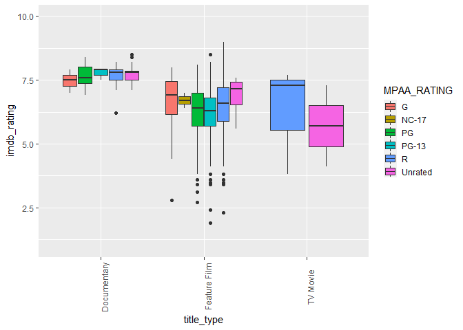

    #plot(ggplot_list[[2]])

For documentary films , we see that imdb rating most likely have more
variability at 70 to 80 + by all mpaa\_rating

for feature films, wee see that IMDB rating most likely have more
variability at5.5 to roughly around 70 and we have outliers for majority
of mpaa\_rating

For TV Movie films, we only have 2 MPAA\_RATING only R and Unrated both
have imdb score below 70 for R and below 60 most likely for Unrated

    plot(ggplot_list[[2]])

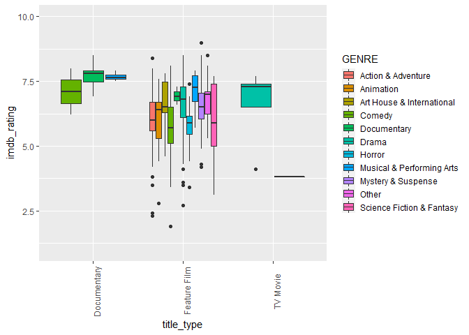
for Documentary we only have 3 genres ,2 genres have rating scores above
7 and 1 below 7, no outliers

for Feature film i guess the variability score is around 5 to 7.5 on
average for all genres

for tv mvoie i guess we only have drama genre with majority have score
6.5 to 7.5 on average

    # Plot the x = mpaa_rating by title type and genre
    plot(ggplot_list[[3]])

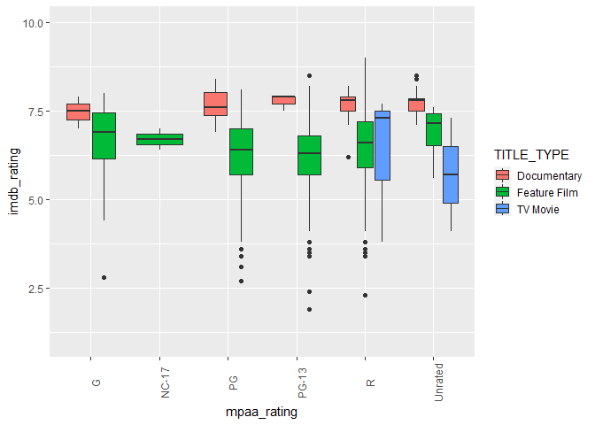
PG-13 “Parents Strongly Cautioned. Some Material May Be Inappropriate
For Children Under 13.” PG: “Parental Guidance Suggested. Some Material
May Not Be Suitable For Children.” G: “General Audiences-All Ages
Admitted.” R: “Restricted, Under 17 Requires Accompanying Parent Or
Adult Guardian.” NC-17: “No One 17 And Under Admitted.”

for G , we have documentary and Feature Film with greatly variability
score between 6 to around 7.5

for Nc-17 we only have 1 type,feature film and the score variablity is
around 6.5 to below 7.0

for pg we only have 2 types , 1 have higher score variability aka above
7.0 the documentary film and 1 below 7.0 the feature film.

for pg-13 we have highly score variability for the documentary type and
also moderate score variability for feature film

for the R documentary seems have higher score variablity followed by tv
mvoie and feature film on average

    plot(ggplot_list[[4]])

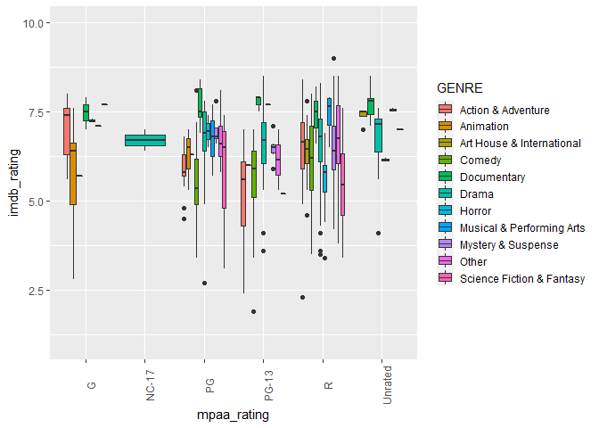
We can see here that genres is arbitary for PG-Pg13 and R ,but heres the
summary , im to lazy to write to conclusion ,sorry ..

    table(subsetMovies$genre,subsetMovies$mpaa_rating)

    ##                            
    ##                               G NC-17  PG PG-13   R Unrated
    ##   Action & Adventure          5     0  21    17  22       0
    ##   Animation                   6     0   3     0   0       0
    ##   Art House & International   0     0   1     1   8       4
    ##   Comedy                      1     0  22    31  33       0
    ##   Documentary                 3     0   7     3   8      30
    ##   Drama                       2     2  45    67 179      10
    ##   Horror                      0     0   2     0  19       2
    ##   Musical & Performing Arts   0     0   3     1   6       2
    ##   Mystery & Suspense          1     0   4    10  44       0
    ##   Other                       0     0   7     2   6       1
    ##   Science Fiction & Fantasy   1     0   3     1   4       0

    plot(ggplot_list[[5]])

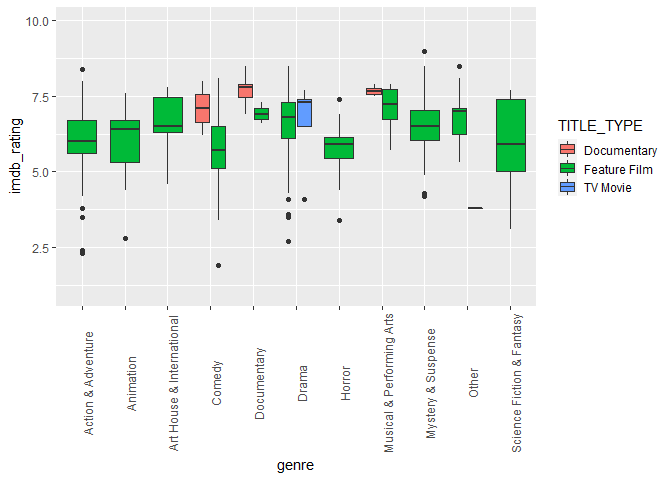

    plot(ggplot_list[[6]])

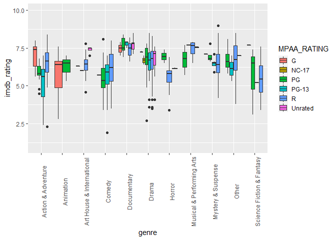
\# Seems The chosen categorical variables the title type have a great
score for predicting the imdb score, from the variability and Genres
also the great one, since we always have documentary with highest score
variability, probably because of the lack of dataset contain film about
documentaries. I guess for this those 2 could be the best categorical
variable compare with mpaa\_rating .

------------------------------------------------------------------------

Part 4: Modeling
----------------

    names(subsetMovies)

    ## [1] "title_type"     "runtime"        "mpaa_rating"    "imdb_num_votes"
    ## [5] "critics_score"  "audience_score" "genre"          "imdb_rating"

    modelLinRegression <- lm(formula = imdb_rating ~ runtime + imdb_num_votes + audience_score +
                                        genre  + title_type ,data = subsetMovies)
    summary(modelLinRegression)

    ## 
    ## Call:
    ## lm(formula = imdb_rating ~ runtime + imdb_num_votes + audience_score + 
    ##     genre + title_type, data = subsetMovies)
    ## 
    ## Residuals:
    ##      Min       1Q   Median       3Q      Max 
    ## -2.77372 -0.17265  0.06902  0.28204  1.01510 
    ## 
    ## Coefficients:
    ##                                  Estimate Std. Error t value Pr(>|t|)    
    ## (Intercept)                     3.554e+00  2.355e-01  15.088  < 2e-16 ***
    ## runtime                         4.394e-03  1.144e-03   3.841 0.000135 ***
    ## imdb_num_votes                  9.075e-07  2.025e-07   4.481 8.83e-06 ***
    ## audience_score                  4.122e-02  1.173e-03  35.138  < 2e-16 ***
    ## genreAnimation                 -3.343e-01  1.794e-01  -1.864 0.062802 .  
    ## genreArt House & International  2.939e-01  1.490e-01   1.972 0.048994 *  
    ## genreComedy                    -1.189e-01  8.260e-02  -1.439 0.150616    
    ## genreDocumentary                2.675e-01  1.981e-01   1.350 0.177382    
    ## genreDrama                      2.129e-01  7.060e-02   3.016 0.002668 ** 
    ## genreHorror                     2.171e-01  1.223e-01   1.775 0.076314 .  
    ## genreMusical & Performing Arts  1.378e-01  1.719e-01   0.801 0.423194    
    ## genreMystery & Suspense         3.903e-01  9.031e-02   4.322 1.79e-05 ***
    ## genreOther                      6.782e-02  1.413e-01   0.480 0.631429    
    ## genreScience Fiction & Fantasy -8.918e-02  1.781e-01  -0.501 0.616713    
    ## title_typeFeature Film         -3.286e-01  1.843e-01  -1.783 0.075050 .  
    ## title_typeTV Movie             -4.910e-01  2.925e-01  -1.679 0.093719 .  
    ## ---
    ## Signif. codes:  0 '***' 0.001 '**' 0.01 '*' 0.05 '.' 0.1 ' ' 1
    ## 
    ## Residual standard error: 0.5005 on 634 degrees of freedom
    ## Multiple R-squared:  0.7921, Adjusted R-squared:  0.7872 
    ## F-statistic:   161 on 15 and 634 DF,  p-value: < 2.2e-16

i m not going to really statistics when interpreting a slope , here’s
what i got,going to interpret the categorical not numeric because those
obvious to interpret

so the base imdb score for all films/movies/documentaries , get 3.5 imdb
score on average given all equal 0

if some movies/films/documentaries out and have the genre Documentary as
an example, it would add score 2.6 on average for imdb score . REMEMBER
: you’re trying to make story with data not show off your statistic
skill , make yourself explanation ez to understand to majority of
audience

lets try to know how much variability is explained by our model

    AnovaResultLinReg <- anova(modelLinRegression)
    # 6 for residuals
    paste("So Here's the percentage of the data that not explained by our model : ", sqrt(AnovaResultLinReg$`Sum Sq`[6]) ,"%" )

    ## [1] "So Here's the percentage of the data that not explained by our model :  12.6023031483312 %"

    AnovaResultLinReg

    ## Analysis of Variance Table
    ## 
    ## Response: imdb_rating
    ##                 Df Sum Sq Mean Sq   F value    Pr(>F)    
    ## runtime          1  54.96   54.96  219.3972 < 2.2e-16 ***
    ## imdb_num_votes   1  49.62   49.62  198.0915 < 2.2e-16 ***
    ## audience_score   1 478.71  478.71 1911.0222 < 2.2e-16 ***
    ## genre           10  20.79    2.08    8.2976 1.004e-12 ***
    ## title_type       2   0.92    0.46    1.8444     0.159    
    ## Residuals      634 158.82    0.25                        
    ## ---
    ## Signif. codes:  0 '***' 0.001 '**' 0.01 '*' 0.05 '.' 0.1 ' ' 1

    # 

Not Bad For first attempt :D

Let’s Diagnostics the Model

    # 1. Linear Relationship between predictors and y
    TotalObservation <-1 : nrow(subsetMovies)

    modelLinRegression$residuals

    ##             1             2             3             4             5 
    ## -1.2997977584  0.0678233468  0.3528731785 -0.0137203086  0.1468966228 
    ##             6             7             8             9            10 
    ##  0.0903776740  0.0003972240 -0.2863716531 -0.3777222590 -0.0931127755 
    ##            11            12            13            14            15 
    ## -0.1403628049  0.1822346160  0.1582784468  0.1459261376 -1.4832283005 
    ##            16            17            18            19            20 
    ##  0.2838899086 -0.2114941939 -0.8021945798 -0.4659398434 -1.0361965227 
    ##            21            22            23            24            25 
    ## -0.0433022001 -0.1300334843  0.5451225024 -0.6831965433  0.2180204581 
    ##            26            27            28            29            30 
    ##  0.0755516460 -0.6077025955 -0.0016403112 -0.1424579597  0.0144545061 
    ##            31            32            33            34            35 
    ##  0.1088439476  0.5016342361  0.6564019512 -0.1818871730  0.2609425024 
    ##            36            37            38            39            40 
    ##  0.2693859006  0.0401170755  0.0521947037  0.2745263814  0.1248336993 
    ##            41            42            43            44            45 
    ##  0.0521371372  0.0945117426 -0.0510943181  0.2193306215 -0.2430231990 
    ##            46            47            48            49            50 
    ##  0.3324662253  0.0982099682  0.6439436120 -1.9054377291  0.5329450793 
    ##            51            52            53            54            55 
    ## -0.4348151535  0.4253395522 -0.0034936844  0.4730600310 -0.2959249917 
    ##            56            57            58            59            60 
    ## -0.2308729246  0.0900832243  0.0456744209  0.0893387549  0.5315454280 
    ##            61            62            63            64            65 
    ##  0.5290654981  0.3010526237  0.2532902491 -0.0962602948 -0.0119229657 
    ##            66            67            68            69            70 
    ## -1.0363752408  0.1029192051  0.3003514035  0.4030609320 -0.2689728148 
    ##            71            72            73            74            75 
    ##  0.3521961243  0.7526829740  0.2714110657  0.1870442039  0.3240079949 
    ##            76            77            78            79            80 
    ##  0.3795108250  0.5834040903  0.0879739321 -0.1402928697  0.1001469262 
    ##            81            82            83            84            85 
    ##  0.0889394736 -0.0520850236  0.4630452797  0.5038349164  0.0682590862 
    ##            86            87            88            89            90 
    ## -0.3462926646  0.0182514635 -0.8226437624 -0.2497678998  0.4981103522 
    ##            91            92            93            94            95 
    ##  0.0179840889  0.2643221381  0.0710128746 -0.7433254843  0.1613384912 
    ##            96            97            98            99           100 
    ##  0.1333340015  0.7739050270 -0.0423296789  0.5851362325 -0.1125039376 
    ##           101           102           103           104           105 
    ##  0.0142167468  0.6097109733  0.4800809212  0.4072245216 -0.7448447295 
    ##           106           107           108           109           110 
    ##  0.6450078551  0.1191328290  0.2145033482  0.6772806997 -1.1817754009 
    ##           111           112           113           114           115 
    ## -0.0797963027 -0.5646510468 -0.1903353076 -0.1726535489  0.2636349342 
    ##           116           117           118           119           120 
    ## -0.8991947324  0.2707998153  0.0658860048  0.2094811311 -0.1372439086 
    ##           121           122           123           124           125 
    ##  0.2419667482  0.0887670288 -2.2946494466 -0.0652587441  0.0268032800 
    ##           126           127           128           129           130 
    ## -2.7737214930  0.1187630247  0.9698347764 -0.2621480815  0.4941686301 
    ##           131           132           133           134           135 
    ##  0.2562148697 -0.1596779935 -1.6841237842 -0.5580305549 -0.0167969585 
    ##           136           137           138           139           140 
    ##  0.9747448796  0.1138780881 -0.2124965157 -0.3180232360  0.2812958345 
    ##           141           142           143           144           145 
    ##  0.3782796082  0.3902780813  0.1556487515  0.2223373288  0.1367365280 
    ##           146           147           148           149           150 
    ## -0.1399878372  0.3066685880  0.3681814531  0.0255656022  0.1481782896 
    ##           151           152           153           154           155 
    ## -0.9243999429 -0.6676045272 -0.6398314217  0.0849420641 -0.8599366816 
    ##           156           157           158           159           160 
    ##  0.8598486214 -0.0414970216 -1.0070618543 -0.0289597409 -0.3099744551 
    ##           161           162           163           164           165 
    ##  0.0997647925  0.1110492298 -0.1425966279  0.3092932501 -1.2686652579 
    ##           166           167           168           169           170 
    ##  0.1961679504  0.2191990181  0.1064291244  0.1538244321  0.4179144337 
    ##           171           172           173           174           175 
    ## -0.0437638179 -0.0760436158  0.4003683643  0.3754582251  0.2208531742 
    ##           176           177           178           179           180 
    ##  0.5567683622  0.4201422268 -0.1199517909  0.1229216632  0.0578530822 
    ##           181           182           183           184           185 
    ## -0.6346190015  0.0317324907  0.2444323427  0.3301299512 -0.4501870273 
    ##           186           187           188           189           190 
    ## -0.2004193291 -1.8554391650  0.9635910348  0.1909588782  0.6247151831 
    ##           191           192           193           194           195 
    ##  0.2895076527  0.3649257257  0.2788903927 -0.1374954066  0.0195960302 
    ##           196           197           198           199           200 
    ##  0.2439277031  0.3596686002 -0.5156724130  0.6191962808  0.4884355267 
    ##           201           202           203           204           205 
    ##  0.1160225543  0.7832349084 -0.9085803960 -0.1798671337  0.0358115131 
    ##           206           207           208           209           210 
    ## -0.1123599279 -0.1974689384 -0.2121321371 -0.5615467632  0.5556609720 
    ##           211           212           213           214           215 
    ## -0.1866965084 -0.5016935598  0.1237490419 -0.1971332166  0.3571512864 
    ##           216           217           218           219           220 
    ## -2.6849184058  0.1501675915 -0.8125648717  0.3330154774  0.1642498612 
    ##           221           222           223           224           225 
    ##  0.3402240837  0.4530022627 -0.5939937349  0.3206394741  0.8089904273 
    ##           226           227           228           229           230 
    ##  0.1939661759  0.1758034390 -0.0821831300 -0.3635371586  0.6189673674 
    ##           231           232           233           234           235 
    ##  0.1860089532  0.3570048985 -0.2046005217  0.1231889777  0.0069605264 
    ##           236           237           238           239           240 
    ## -0.3537847761 -0.1290670282  0.1224533158  0.0504780941 -0.1213524977 
    ##           241           242           243           244           245 
    ##  0.0301748185  0.0940962179  0.5798554182  0.0446054964  0.2382208089 
    ##           246           247           248           249           250 
    ## -0.4591459446 -0.0874316726  0.1271068888 -0.3161139249  0.1759290189 
    ##           251           252           253           254           255 
    ## -2.2739522546  0.2269667652  0.0624158290  0.2226579596 -0.0834680554 
    ##           256           257           258           259           260 
    ## -0.0068454461 -0.0545216260 -0.3489338014 -0.2954061735  0.0015240439 
    ##           261           262           263           264           265 
    ## -0.5300951923  0.0904091365  0.1370983931  0.4535210013  0.2541000840 
    ##           266           267           268           269           270 
    ## -0.1502454612 -0.1172332134  0.1527228870  0.4750987993  0.2545276997 
    ##           271           272           273           274           275 
    ##  0.2977111114  0.5115257941  0.0595244798  0.1730640890  0.1337404303 
    ##           276           277           278           279           280 
    ##  0.1374792277 -0.4096786534  0.3046542299 -0.4258159945 -0.3680925282 
    ##           281           282           283           284           285 
    ##  0.0587393836  0.8587750321  0.4960709290 -0.6598908276 -0.0406695307 
    ##           286           287           288           289           290 
    ## -0.2875757141  0.0714326243  0.2497718078  0.4582654706 -0.3507155729 
    ##           291           292           293           294           295 
    ##  0.2044810135  0.4467635411  0.0909240403  0.1268960688 -0.4759511198 
    ##           296           297           298           299           300 
    ## -0.0444754434 -0.1958233637 -0.3645498237 -0.0348258308 -0.2744821121 
    ##           301           302           303           304           305 
    ##  0.0424261199  0.6958940319 -0.0305938303 -0.5373762679 -0.1143262065 
    ##           306           307           308           309           310 
    ##  0.4913413453  0.3714788629  0.1995865270  0.0714711850  0.3555914006 
    ##           311           312           313           314           315 
    ##  0.2797207477  0.4376602211  0.4984968075  0.1508674526  0.1307890997 
    ##           316           317           318           319           320 
    ##  0.4195924670  0.5034948507  0.0353456162 -0.4764050372 -0.6896587596 
    ##           321           322           323           324           325 
    ##  0.1839924635  0.3540699446 -0.3252398439  0.4241197181  0.7694107267 
    ##           326           327           328           329           330 
    ##  0.3303942761  0.3086330224  0.4271111319  0.0338180554  0.0063904346 
    ##           331           332           333           335           336 
    ## -0.8574937846  0.1342551908  0.4600179374  0.3412421637  0.1866859308 
    ##           337           338           339           340           341 
    ## -0.1501343555 -0.0837298014  0.5176341426  0.6796175980  0.3626634872 
    ##           342           343           344           345           346 
    ##  0.1692347594 -0.1067696821  0.2593952674 -0.3283355220 -0.2665148229 
    ##           347           348           349           350           351 
    ##  0.0446054964 -2.5782092371  0.2522237069  0.3756600786  0.0612716461 
    ##           352           353           354           355           356 
    ## -0.1822457941  0.0809659900 -0.0378989801  0.1781519053  1.0150969154 
    ##           357           358           359           360           361 
    ## -0.1060215751  0.0406706682  0.3524764895  0.1737419515  0.2246671598 
    ##           362           363           364           365           366 
    ## -0.0976235493 -0.2782264937 -0.2911859903 -0.1540953150 -1.1011735872 
    ##           367           368           369           370           371 
    ##  0.1323613962 -0.3044907723 -0.1849264654 -0.5834034783 -0.8875328424 
    ##           372           373           374           375           376 
    ##  0.3356872018 -0.2415285923 -0.3132089693 -0.6891461809 -2.4384145133 
    ##           377           378           379           380           381 
    ## -1.1619044988  0.1872057478  0.0298148936 -0.4428109910 -0.0761985329 
    ##           382           383           384           385           386 
    ## -0.1651113163 -0.0758007345 -0.2193956944  0.2213663702  0.0697745732 
    ##           387           388           389           390           391 
    ##  0.0568813879 -0.3873579153  0.1507561097  0.5410244376  0.4169706894 
    ##           392           393           394           395           396 
    ##  0.3559141601  0.3798550003  0.0760220620  0.0930125881 -0.1270308026 
    ##           397           398           399           400           401 
    ## -0.4047272831  0.3559575583  0.5202376347  0.3683987347  0.1993013014 
    ##           402           403           404           405           406 
    ##  0.1382945053  0.8173256362  0.0654273146 -0.1539298679  0.2261704519 
    ##           407           408           409           410           411 
    ##  0.4466952731 -1.3358303077 -0.1433832299  0.1140812759  0.2690174224 
    ##           412           413           414           415           416 
    ##  0.2215116860 -0.1595588253 -0.3463884016  0.4802392819 -0.0724945486 
    ##           417           418           419           420           421 
    ##  0.3787279262 -0.0452435866  0.4876992056 -0.6750323110  0.0802779365 
    ##           422           423           424           425           426 
    ## -0.4522843803  0.0373642497 -0.0816473014 -0.3977347952 -0.2626291430 
    ##           427           428           429           430           431 
    ## -0.4013653953  0.8255133770  0.0656331385  0.0050529590  0.4274662568 
    ##           432           433           434           435           436 
    ##  0.4143329458 -0.2628522902  0.2822856668  0.0255268951 -0.0901509753 
    ##           437           438           439           440           441 
    ## -0.2798090782  0.2170689030 -0.7116916813  0.4579273522  0.3983079970 
    ##           442           443           444           445           446 
    ## -0.0473865678  0.3363796390  0.0498582562 -0.0608708887  0.0419595649 
    ##           447           448           449           450           451 
    ##  0.9806055106  0.6638135474 -0.1925957713  0.0475067208  0.1327490268 
    ##           452           453           454           455           456 
    ## -0.1975093411  0.3730324969 -0.0174989575  0.2316618205  0.9539113657 
    ##           457           458           459           460           461 
    ## -0.0221388766  0.0016631275 -1.3992005539  0.0286229091 -0.7782387143 
    ##           462           463           464           465           466 
    ##  0.1722559854 -1.1390410548 -0.5822333680  0.3673253130  0.0957005275 
    ##           467           468           469           470           471 
    ##  0.1867113373  0.3210048035 -0.0860769893 -0.1759875084  0.1342843441 
    ##           472           473           474           475           476 
    ##  0.1341645063  0.6585692515 -0.0979362936  0.2712454073  0.5267032210 
    ##           477           478           479           480           481 
    ## -0.0252755904 -1.1046540607  0.0065084206 -0.0498147353  0.1224894786 
    ##           482           483           484           485           486 
    ## -0.2714071949 -1.0553729251 -0.0820627016 -0.1565556338 -0.5384237715 
    ##           487           488           489           490           491 
    ##  0.0776235819 -0.1724779536 -0.1360483851 -0.6098714729  0.0523347027 
    ##           492           493           494           495           496 
    ## -0.9695255114  0.3058180265 -0.0787429623  0.6528261970  0.1955192692 
    ##           497           498           499           500           501 
    ## -0.2773331957  0.2233508366  0.4076709767  0.8989332423  0.1346486048 
    ##           502           503           504           505           506 
    ## -0.0136202547 -1.2270964277  0.0125290975  0.4181422040 -0.5429734863 
    ##           507           508           509           510           511 
    ##  0.3237680840  0.2061170416  0.5993716754 -0.7422480155 -0.0487732459 
    ##           512           513           514           515           516 
    ##  0.2450756775  0.4034366292 -0.2623713163  0.0152954866  0.1885022897 
    ##           517           518           519           520           521 
    ##  0.7066662027  0.6591914490 -0.2032663696  0.7102479279  0.4948438615 
    ##           522           523           524           525           526 
    ##  0.1534975664 -0.0923007167  0.5425475094 -0.0825211883 -0.1054179792 
    ##           527           528           529           530           531 
    ##  0.8174205758  0.1080924982 -0.1307552307  0.0874398260  0.6271805261 
    ##           532           533           534           535           536 
    ## -0.2822957664 -0.0011512708  0.0219691287  0.2603500785  0.3592499067 
    ##           537           538           539           540           541 
    ## -0.1726530569  0.3368942116 -0.6826610996  0.1462632690  0.0956037842 
    ##           542           543           544           545           546 
    ## -0.0959282624  0.0838733711  0.0622042500 -0.5915253359 -0.6284201954 
    ##           547           548           549           550           551 
    ## -0.4235234569 -0.5666171849  0.3696061328  0.0835476616 -0.4324640989 
    ##           552           553           554           555           556 
    ##  0.3263522040  0.4626176063  0.2312505639  0.0231328499 -0.0650921585 
    ##           557           558           559           560           561 
    ##  0.4197319458  0.2114959549 -0.3202182144  0.5993141545  0.0003665462 
    ##           562           563           564           565           566 
    ## -0.1573855429  0.5314262205 -0.1405285631 -0.1740424474  0.7697517885 
    ##           567           568           569           570           571 
    ## -0.6104132250 -0.1290406663 -0.1170644036  0.1916851315 -0.1726255329 
    ##           572           573           574           575           576 
    ##  0.2127030467  0.0842770474  0.1989864875 -0.0887875988 -0.4202599253 
    ##           577           578           579           580           581 
    ## -0.2105045173 -0.1302601635  0.4107085423  0.1141356888 -0.2542833559 
    ##           582           583           584           585           586 
    ##  0.7242367670 -1.0210820238 -0.3051099365  0.3608584840 -0.6991124002 
    ##           587           588           589           590           591 
    ##  0.1952554916  0.1217962920  0.0014980611 -0.0486072324 -0.1188513321 
    ##           592           593           594           595           596 
    ## -0.7111542282  0.0656541102 -0.1722648227  0.1656953352  0.1776677836 
    ##           597           598           599           600           601 
    ##  0.3200689790  0.1495548137  0.5712784688  0.5781925122  0.0877443020 
    ##           602           603           604           605           606 
    ##  0.3770867179  0.1543631705  0.3543136116  0.4288020809 -0.2301864135 
    ##           607           608           609           610           611 
    ##  0.1243666961 -0.0156639871  0.4286338331 -0.1215893540 -0.1893585463 
    ##           612           613           614           615           616 
    ##  0.4851583974  0.2199391992  0.6420742430 -0.0900974648  0.1275021906 
    ##           617           618           619           620           621 
    ## -1.1122634096 -0.0056087677 -0.1470610182  0.0911959360 -0.6033133217 
    ##           622           623           624           625           626 
    ##  0.0056369789  0.3478867721  0.0362818906  0.5388873642 -0.0770333748 
    ##           627           628           629           630           631 
    ##  0.0511606572 -0.3863719876 -0.1480823357 -1.2099455206  0.0407908930 
    ##           632           633           634           635           636 
    ## -0.6676641188 -0.7145633318 -0.4003492467 -0.1833141577  0.0674437302 
    ##           637           638           639           640           641 
    ##  0.6847449245  0.1426410153  0.1953431055  0.0937334454 -0.7240602135 
    ##           642           643           644           645           646 
    ##  0.2065040663  0.0340197331 -0.2264454975  0.2027941832 -0.2012690774 
    ##           647           648           649           650           651 
    ##  0.9562180040 -0.1482686740  0.1396684918  0.5858971150 -1.4745709218

    ggplot2::ggplot(data = modelLinRegression ,aes(x = TotalObservation ,y = .resid))+
      ggplot2::geom_point()+
      ggplot2::geom_hline(yintercept =  0 , col = "red" , linetype = "dashed")

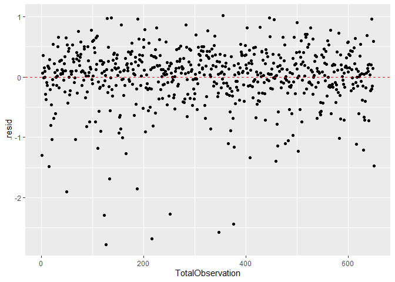

    plot(TotalObservation, modelLinRegression$residuals )

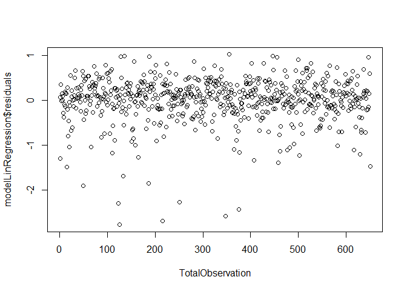
Seems yep most observation lies around 0 , which we can say this
diagnostics is clear to go

Let’s Check the normal Distribution of this guy residuals

    # 2. Nearly Normal residuals
    histogram <- ggplot2::ggplot(data = modelLinRegression , aes(x = .resid))+
      ggplot2::geom_histogram(aes(y =..density..),fill= "orange",col = 'black',bins = 100) + 
      ggplot2::geom_density(col = "blue")
    #qqplotplot <- 
    ggplotQQ <- function(lm){
      # This Function Purpose
      # extract standardized residuals from the fit
      # and Create the qqplot with its line
        dfModel <- data.frame(std.resid = rstandard(model = lm))
        
        yAxis <- quantile(dfModel$std.resid,p = c(0.25,0.75))
        xAxis <- qnorm(p= c(0.25,0.75))
        slope <- diff(yAxis) / diff(xAxis)
        intercept <- yAxis[1] - slope * xAxis[1]
      
        plotted <- ggplot2::ggplot(data = dfModel, aes(sample = std.resid))  +stat_qq(shape = 1 ,size = 3)+
          geom_abline(slope = slope , intercept = intercept, linetype = "dashed",col= 'red') 
        return (plotted)
        
        
    }
    qqplotline <- ggplotQQ(modelLinRegression)

    grid.arrange(histogram, qqplotline , nrow =1 ,ncol = 2 ,widths = c(4,2) )

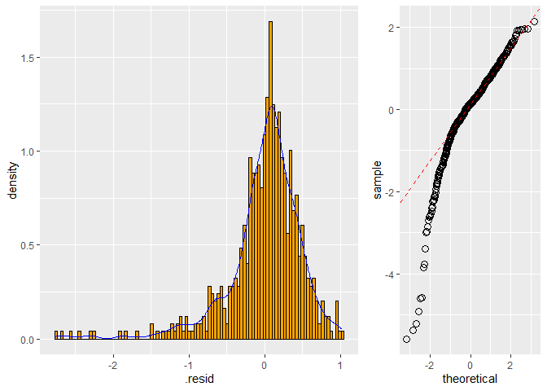
below there it’s because outliers but overall this is looks like normal
shape :D

lets check constant variability

    ResidAndFittedPlt <- ggplot2::ggplot(data = modelLinRegression,aes(x = .fitted , y = .resid))+
      geom_point() +
      geom_hline(yintercept = 0, col = "red" , linetype ='dashed')

    AbsResidAndFittedPlt <- ggplot2::ggplot(data = modelLinRegression,aes(x = .fitted , y = abs(.resid)))+
      geom_point() +
      geom_hline(yintercept = 0, col = "red" , linetype ='dashed')

    grid.arrange(ResidAndFittedPlt , AbsResidAndFittedPlt , ncol = 2,nrow = 1 , widths = c(4,2))

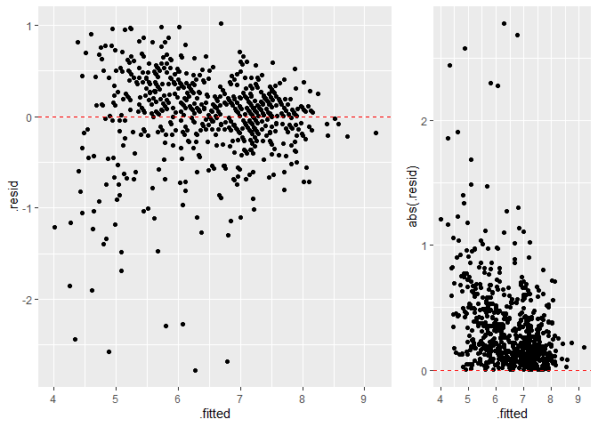
I guess we can say this diagnostics is fine to , because fitted and
resid most likely lies around 0 , remember this is lin reg, we have this
result is a good enough , wecan improve it to , with polynomial model or
doing randomforest

This is not time series , and the data collected randomly so we can
assume that this data is independent residuals .

------------------------------------------------------------------------

Part 5: Prediction
------------------

    #lets try to see the predicted

    pred.int <- predict(modelLinRegression , interval = "prediction")

    ## Warning in predict.lm(modelLinRegression, interval = "prediction"): predictions on current data refer to _future_ responses

    ModifiedSubset <- cbind(subsetMovies[, c("title_type","runtime","imdb_num_votes", "audience_score", "genre", "imdb_rating")], pred.int)

    head(ModifiedSubset)

    ##     title_type runtime imdb_num_votes audience_score       genre imdb_rating
    ## 1 Feature Film      80            899             73       Drama         5.5
    ## 2 Feature Film     101          12285             81       Drama         7.3
    ## 3 Feature Film      84          22381             91      Comedy         7.6
    ## 4 Feature Film     139          35096             76       Drama         7.2
    ## 5 Feature Film      90           2386             27      Horror         5.1
    ## 6  Documentary      78            333             86 Documentary         7.8
    ##        fit      lwr      upr
    ## 1 6.799798 5.812716 7.786880
    ## 2 7.232177 6.246436 8.217917
    ## 3 7.247127 6.253781 8.240473
    ## 4 7.213720 6.226646 8.200795
    ## 5 4.953103 3.948297 5.957909
    ## 6 7.709622 6.716089 8.703155

Well Not bad ,really not bad for this we not really far with the actual answer .
================================================================================

lets See the prediction and confidence interval thershold

    # just going to plot 1 of numerical variable
      ggplot2::ggplot(data = ModifiedSubset , aes(y = imdb_rating , x = fit))+
      geom_point()+
      geom_smooth( method = "lm" ) + 
      ggplot2::geom_line(aes(y = lwr),col = "red", linetype = "dashed")+
      ggplot2::geom_line(aes(y = upr),col = "red", linetype = "dashed")

    ## `geom_smooth()` using formula 'y ~ x'

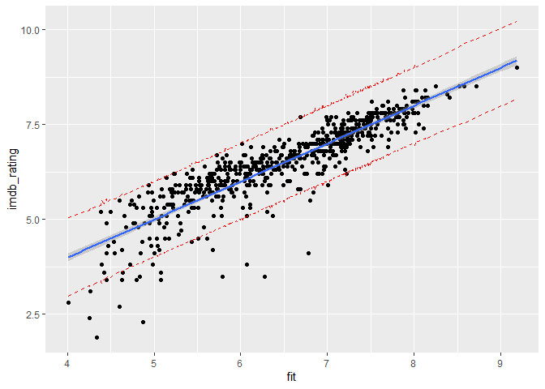

------------------------------------------------------------------------

Part 6: Conclusion
------------------

So my conclusion,our Model is not bad at all ,we found that rouhgly 78
percent our model correctly predict given variables , and the prediction
interval is quitely larger , and also we know that in this model we used
only 7 variables and we come with a great r adjusted squared and loss
the diagonostics test, so as far as i can tell the best predictors to
predict this imdb\_rating is :
“title\_type”,“runtime”,“imdb\_num\_votes” ,“audience\_score”, “genre”
,“imdb\_rating”
